 # Nodejs และ Backend development คืออะไร ?
 - Backend คือ สิ่งที่ run อยู่ภายในด้านหลังที่ user ไม่สามารถมองเห็นหรือ access เข้ามาได้ จะใช้สำหรับการคุยกับเครื่อง server และคุยกับฐานข้อมูล (จะแตกต่างกับ Frontend ที่จะเป็นคนคุยกับ user มา)
 - Nodejs คือ runtime environment JS engine สิ่งที่ทำให้ javascript run backend ออกมาได้ เมื่อก่อน javascript เป็นภาษาที่ใช้เพียงแค่ฝั่ง Frontend แต่ปัจจุบันเป็นภาษาที่พัฒนาได้ทั้ง 2 ฝั่งแล้ว = บางคนก็เลยเรียกตัวเองว่าเป็น Fullstack Javascript

# ทดลองสร้าง server backend
## Hello world nodejs
1. ที่ terminal ให้พิมพ์ "ls" อีกทีจะเจอ folder server ให้ cd

ถ้าทุกอย่างออกมาถูกต้องจะได้หน้าตาออกมาเป็นประมาณนี้
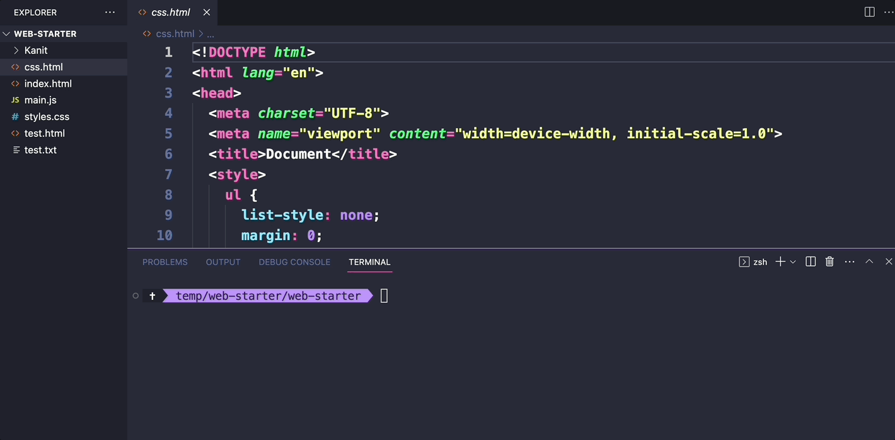
**"ls" คือคำสั่งcml(command line)เรียกดูไฟล์ในโฟลเดอร์**

**"dir" คือคำสั่งcml(command line)เรียกดูไฟล์ในโฟลเดอร์ของCMD**

**"CD" คือเข้าถึงไฟล์ในโฟลเดอร์ที่ได้ป้อนไป**

2. เริ่มต้น npm init กด enter ให้หมด > เสร็จแล้วจะได้ไฟล์ package.json ออกมาใน folder server หากใช้คำสั่งนี้ใน powershell ไม่ได้ให้ลองใน CMD ดู
3. สร้างไฟล์ index.js ขึ้นมา ข้างในใส่คำสั่ง console.log(“Hello world”)
4. พิมพ์คำสั่ง "node index.js" จะแสดง Hello world ออกมาผ่าน terminal ได้

ถ้าทุกอย่างออกมาถูกต้องจะได้หน้าตาออกมาเป็นประมาณนี้
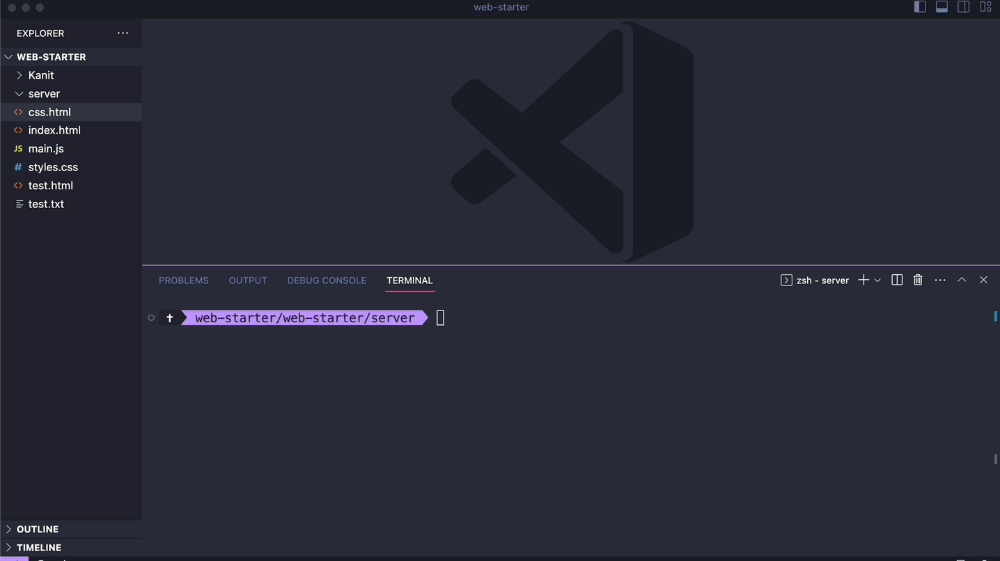

`node index.js`
- เป็นคำสั่งสำหรับการ run ไฟล์ javascript ด้วย nodejs ทำให้เราสามารถนำไฟล์ javascript มา run บน environment ของ nodejs ได้

# สร้าง http server
เราจะเริ่มต้นสร้าง http server กัน ในการทำ Backend นั้นเริ่มแรกสุดเราต้องทำการ run server ขึ้นมาเพื่อเป็นเครื่องที่เป็นตัวแทนสำหรับการพูดคุยระหว่าง browser และ server (ตัวเครื่องที่วาง nodejs อยู่)

ที่ไฟล์ index.js ให้เราเพิ่มไฟล์ไปตามนี้
```js
// ทำการ import http เข้ามาเพื่อทำการ run server
const http = require('http')


// กำหนด host และ port เริ่มต้น
const host = 'localhost'
const port = 8000


// กำหนดค่าเริ่มต้นของ server เมื่อเปิดหน้าเว็บที่ 
localhost:8000 ขึ้นมา
const requestListener = function (req, res) {
  res.writeHead(200)
  res.end("My first server!")
}


// ทำการ run server
const server = http.createServer(requestListener)
server.listen(port, host, () => {
    console.log(`Server is running on http://${host}:${port}`)
})
```
หลังจากนั้นลอง run ด้วยคำสั่ง "node index.js" จะขึ้นแสดงข้อความมาว่า run web แล้วนะที่ port 8000


เมื่อเราลองไปเปิดที่ Browser เราจะได้เว็บที่ localhost:8000 ขึ้นมา
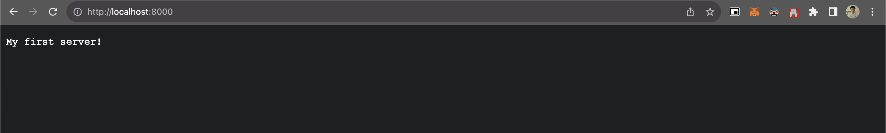

สิ่งที่เราทำไปคือ เราทำการเปิด server ขึ้นมาหนึ่งตัว (อยู่บนเครื่องคอมพิวเตอร์ของเรา) โดยเปิด port หรือช่องทางการสื่อสารไว้เป็น port = 8000
- เท่ากับว่า หากเราเขียนการรับหรือการส่งข้อมูลผ่าน port = 8000 เข้าไป เท่ากับ เป็นการสื่อสารกับ server ของ nodejs ที่ไฟล์ index.js นี้ได้

# Mysql และ Database
ฐานข้อมูล คือสิ่งที่ใช้สำหรับเก็บข้อมูลที่เกิดขึ้นภายในเว็บไซต์ไว้ เช่น
- ข้อมูลการสมัครของ user
- ข้อมูลสินค้าที่ใช้ขายของ
- ข้อมูลการซื้อขาย ทุกข้อมูลจะถูกเก็บในฐานข้อมูล ความสะดวกสบายกว่าการเก็บใส่ disk ของฐานข้อมูลคือ เหล่าฐานข้อมูลพวกนี้จะมีความสามารถเรียกใช้งานที่ง่ายกว่า (ผ่านคำสั่งที่เตรียมไว้) มันจึงเหมาะสำหรับการเอาไปใช้เก็บข้อมูลร่วมกับ Backend server
### ปกติฐานข้อมูลแบ่งเป็น 2 ประเภท คือ SQL และ NoSQL
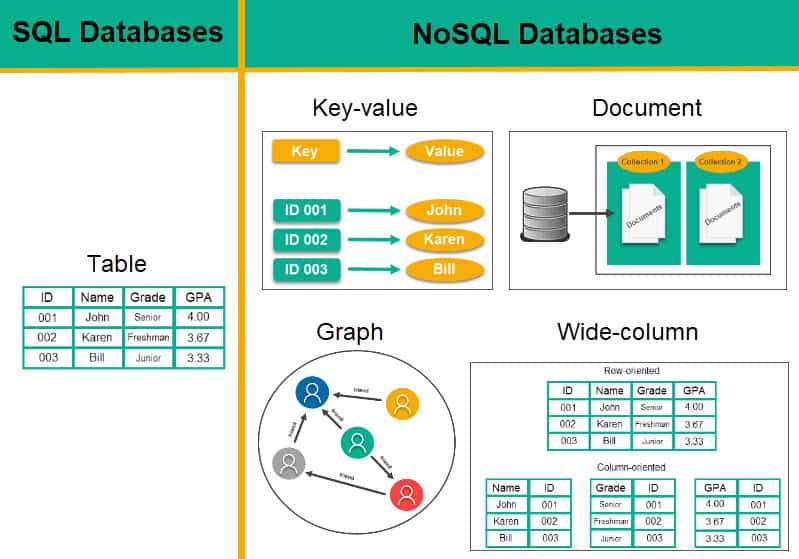

#### 1. Relational Database (ตระกูล SQL) 
คือฐานข้อมูลที่จะเก็บข้อมูลไว้เป็นโครงสร้างที่ถูกกำหนดไว้ก่อนแล้ว ปกติจะอยู่ในรูปแบบตาราง เช่น user เราสร้าง column สำหรับจัดเก็บข้อมูล ชื่อ, นามสกุล, เพศ ก็จะต้องเก็บอยู่ใน column เท่านั้น

ตัวอย่างการเก็บข้อมูล
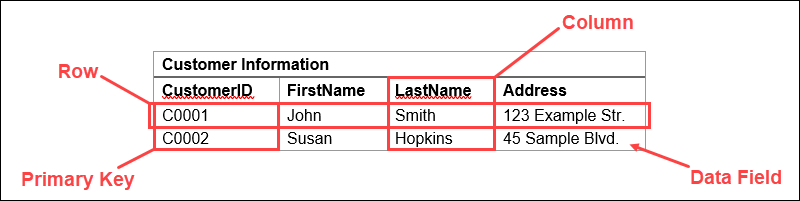

#### 2. Non - Relational Database (ตระกูล NoSQL)
คือฐานข้อมูลที่จะเก็บข้อมูลไว้แบบ Dynamic นั่นคือ ไม่จำเป็นต้องกำหนดโครงสร้างพื้นฐานก่อนก็สามารถเก็บข้อมูลเข้าไปได้ เช่น เรามีตารางชื่อ users ถ้า
- user คนแรกมีชื่อจริง, นามสกุล
- user อีกคนมีชื่อจริง, นามสกุล, ชื่อกลาง
- user อีกคนมีแค่ชื่อจริง ทั้ง 3 คนนี้สามารถจัดเก็บไว้ในตารางเดียวกันได้ (ศัพท์ฝั่ง NoSQL ส่วนนึงจะเรียกว่า เก็บไว้ใน collection เดียวกันได้)

ตัวอย่างการเก็บข้อมูล


### องค์ประกอบของ Database จะประกอบไปด้วย 2 อย่างคือ
1. Database ก้อนไหน
2. Table (หรือตารางในภาษาไทย) ใน Database นี้มีอะไรบ้าง

ปกติตอนทำการสร้าง Database แบบ Relational database อย่าง MySQL เราต้องกำหนด spec ของทุก Table เอาไว้สำหรับการเก็บข้อมูล

เช่น ตามภาพด้านล่างนี้ นี่คือภาพของ Database 1 ก้อน ที่ประกอบไปด้วย 7 tables จะขอยกตัวอย่างจาก table ชื่อ products

table product นั้นจะเก็บทั้งหมด 7 columns คือ

- id (สำหรับเป็น Primary key หลัก)
- name (ชื่อสินค้า)
- merchant_id (เป็น Foreign key สำหรับเก็บคนขาย)
- price (ราคา)
- status (สถานะสินค้า)
- created_at (วันที่สร้าง)
- category_id (เป็น Foreign key สำหรับเก็บประเภทสินค้า)

เป็นต้น (สำหรับใครที่ยังงงๆ Primary key, Foreign key รวมถึง int, varchar ตามภาพนี้ เดี๋ยวจะมีอธิบายเพิ่มเติมด้านล่าง)
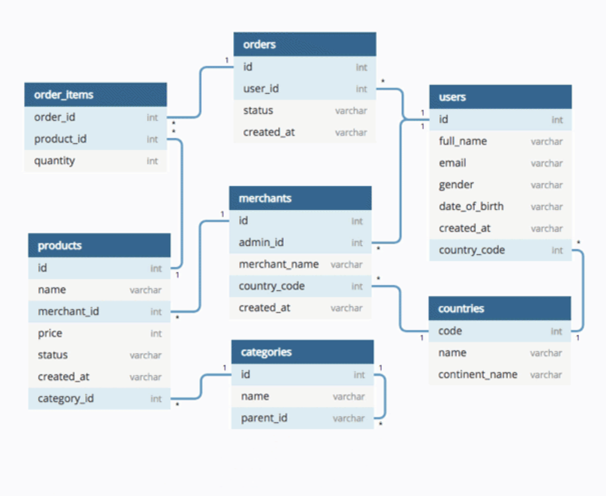

# ภาษา SQL คืออะไร ?
ภาษา SQL เป็นภาษาที่เราจะใช้สื่อสารกับฐานข้อมูล จะทำให้ server อย่าง nodejs เป็นสามารถพูดคุยกับฐานข้อมูล เพื่อทำการ ดึงข้อมูล หรือ update ข้อมูลไปได้

## CRUD ใน SQL
- C = Create (สามารถสร้างข้อมูลได้)
- R = Read (สามารถอ่านหรือค้นหาข้อมูลได้)
- U = Update (สามารถแก้ไขข้อมูลได้)
- D = Delete (สามารถลบข้อมูลได้)

### 1. C = Create = Insert ข้อมูล
```sql
INSERT INTO <ชื่อตาราง> (column ทั้งหมดที่ต้องการ insert) VALUES(ข้อมูลแต่ละตัวที่จะใส่ column)
```

ตัวอย่างเช่น ถ้าต้องการใส่ข้อมูล 1 ตัวที่มีค่า
- firstname = ไมค์
- lastname = ล็อปสเตอร์
- age = 14
- gender = ชาย
- interests = ฟุตบอล, เขียนโปรแกรม
- description = เป็นคนขยันหมั่นเพียร

คำสั่งก็จะหน้าตาประมาณนี้

```sql
INSERT INTO `users` (`firstname`, `lastname`, `age`, `gender`, `interests`, `description`) VALUES ('ไมค์', 'ล็อปสเตอร์', '14', 'ชาย', 'ฟุตบอล, เขียนโปรแกรม', 'เป็นคนขยันหมั่นเพียร');
```

- การใส่ column และ value ต้องตรงกันในแต่ละตำแหน่งที่อยู่ใน ()

### 2. R = Read = Select, Where ข้อมูล
1. ดึงข้อมูลทั้งหมดออกมาทุก column

Pattern คำสั่ง SQL คือ
```sql
SELECT * from <ชื่อตาราง>;
```

2. ระบุ column ที่ต้องการแสดงผล

Pattern คำสั่ง SQL คือ
```sql
SELECT <ชื่อ column ที่ต้องการเลือก> from <ชื่อตาราง>;
```

3. ค้นหาข้อมูลด้วย where

Pattern คำสั่ง SQL คือ
```sql
SELECT <ชื่อ column ที่ต้องการเลือก หรือ * ถ้าเอาทั้งหมด> from users where <column ที่ต้องการค้นหา>=<ค่าอะไร>;
```
- ระบุ column ที่ต้องการหยิบออกมาหรือ * ถ้าเอาทุก column
- หลัง where ระบุ column และ value ที่ต้องการค้นหา

### 3. U = Update = Update ข้อมูล
Pattern คือ
```sql
UPDATE <ชื่อตาราง> SET <column อะไร> = <เปลี่ยนค่าเป็นอะไร> WHERE <โดยเงื่อนไขอะไร ใช้เหมือน select>
```
- ระบุ table ที่ต้องการแก้ไข
- ระบุ column ที่ต้องการแก้ไขและค่าที่ต้องการเปลี่ยน
- ระบุเงื่อนไข (เหมือนกับการใช้ WHERE ตอน search) คือ ระบุ column และ value ที่ต้องการสร้างเงื่อนไขไว้ว่าจะเปลี่ยนกับแค่ตัวไหน

ตัวอย่างที่ 1 

เราจะหา users id = 2 เพื่อทำการ update ข้อมูล firstname เปลี่ยนจากค่าที่เป็นอยู่เป็นคำว่า "เปลี่ยนชื่อ" แทน

```sql
UPDATE `users` SET `firstname` = 'เปลี่ยนชื่อ' WHERE `users`.`id` = 2;
```

### 4. D = Delete = Delete ข้อมูล
Pattern SQL คือ
```sql
DELETE FROM <ชื่อ table> WHERE <โดยเงื่อนไขอะไร>
```
- ระบุ table ที่ต้องการจะเข้าไปลบ
- ท่าระบุเงื่อนไข (เหมือนกับการใช้ WHERE ตอน search) คือ ระบุ column และ value ที่ต้องการสร้างเงื่อนไขไว้ ว่าจะลบเฉพาะข้อมูลอะไรบ้าง (หากไม่ใส่ = ลบทุกตัว)

ตัวอย่าง เช่น ต้องการลบ user ที่มี id = 1 ออกจาก table users

```sql
DELETE FROM `users` WHERE `id` = 1
```

### เพิ่มเติม SQL 
ที่ได้อธิบายไปเป็นพื้นฐานที่ควรรู้ของ SQL เท่านั้น

Reference (อ่านเพิ่มเติมได้)

- https://www.w3schools.com/sql/default.asp
- https://www.codecademy.com/learn/learn-sql

# รู้จักกับ Rest API
REST ย่อมาจาก Representational State Transfer เป็นรูปแบบการส่งข้อมูลแบบหนึ่งที่ส่งผ่าจาก Client (เช่น จากหน้าเว็บ) สู่ Server (Backend เช่น nodejs) ซึ่ง REST นั้นจะอยู่บนพื้นฐานของ HTTP protocal ที่จะทำให้เราสามารถยิงข้อมูลผ่านจากการเปิด Web server ออกมาได้

ซึ่งวิธีการส่งด้วยรูปแบบ REST นั้น สามารถส่งได้หลากหลายประเภทข้อมูลตั้งแต่ Text (ข้อความปกติ), XML (ข้อความโครงสร้างคล้ายๆ HTML), JSON (ข้อความโครงสร้างคล้ายๆ Object ใน Javascript)


# library: express
จริงๆ nodejs เองก็สามารถทำ http protocal แบบ REST API ออกมาได้ แต่มันจะ code ค่อนข้างเยอะพอสมควร ซึ่ง library เริ่มต้นสำหรับคนที่เริ่มต้นทำ REST API จะขอแนะนำ express (ดูตัวอย่าง code ในหัวข้อต่อไปได้)

ใช้ library ใน nodejs (เป็นตัวช่วยทำให้ทำงานง่ายขึ้น) ใน Terminal พิมพ์คำสั่งนี้เพื่อทำการลง package

```
npm install express
```

คำสั่งนี้มีความหมายว่า `npm install <package อะไร>` ในการลง package ของ node จะลงด้วยคำสั่งนี้ (ชื่อ package จะขึ้นอยู่กับ library ที่เราจะลงเพิ่ม)

ดูผลลัพธ์ผ่าน package.json ได้ ตรง dependency จะต้องมี express ขึ้นมาแบบนี้

```json
// file: package.json
{
  "name": "server",
  "version": "1.0.0",
  "description": "",
  "main": "index.js",
  "scripts": {
    "test": "echo \"Error: no test specified\" && exit 1"
  },
  "author": "",
  "license": "ISC",
  "dependencies": {
    "express": "^4.18.2"
  }
}
```
ถ้าขึ้นมาลักษณะนี้ถือว่าถูกต้องแล้ว แปลว่าเป็นการลง library เรียบร้อย (ทุกการลง library จะเป็นแบบนี้เสมอ อีกศัพท์ที่เราจะพูดกันคือลง dependency)

## ลองเทียบ code แบบ ใช้ กับ ไม่ใช้ express
**ไม่ใช้ express (nodejs ปกติ)**
```js
const http = require('http')

// Sample book data
const books = [
  { id: 1, title: 'Book 1', author: 'Author 1' },
  { id: 2, title: 'Book 2', author: 'Author 2' },
  { id: 3, title: 'Book 3', author: 'Author 3' },
]

const server = http.createServer((req, res) => {
  if (req.url === '/api/books' && req.method === 'GET') {
    // Set the response header
    res.setHeader('Content-Type', 'application/json');
    // Send the list of books as JSON
    res.end(JSON.stringify(books));
  } else {
    // Handle other routes
    res.statusCode = 404;
    res.end('Not Found');
  }
})

const port = 3000;
server.listen(port, () => {
  console.log(`Server is running on port ${port}`)
})
```
**กับใช้ express**
```js
const express = require('express')
const app = express()

// Sample book data
const books = [
  { id: 1, title: 'Book 1', author: 'Author 1' },
  { id: 2, title: 'Book 2', author: 'Author 2' },
  { id: 3, title: 'Book 3', author: 'Author 3' },
]

// Endpoint to get all books
app.get('/api/books', (req, res) => {
  res.json(books)
})

const port = 3000;
app.listen(port, () => {
  console.log(`Server is running on port ${port}`)
})
```
2 code นี้ทำงานให้ผลลัพธ์ออกมาเหมือนกัน แต่อย่างที่ทุกคนเห็น
- ฝั่ง nodejs ต้องประกาศการสร้าง server ด้วย createServer แต่ฝั่ง express แค่ใช้ listen ก็สามารถเปิดได้แล้ว
- api ก็เช่นเดียวกัน ฝั่ง nodejs ต้องใช้ if / else ในการแยก แต่ฝั่ง express สามารถใช้ app.get() ออกมาได้เลย

ซึ่งคำว่า .get() หมายถึงการยิงแบบ method GET เข้ามา (เดี๋ยวจะอธิบายเพิ่มเติมกันตรงหัวข้อ Rest API method ด้านล่าง)

app.get('/', (req, res) => {}) parameter 2 ตัวประกอบด้ว
- parameter ที่ 1 '/' คือการระบุ path ที่เปิดให้ส่งข้อมูล
- parameter ที่ 2 (req, res) คือ function ที่จะจัดการหลังข้อมูลที่ส่งเข้ามาจาก client (ผ่าน req) โดย ตัวแปร req = request ที่ client (หรือ user) ส่งมา, res = response ที่สามารถกำหนดการส่งออกของ API ได้
- ดังนั้น res.send('Hello world') คือการส่ง response จาก API กลับออกไปยังฝั่ง Client

ภาพ diagram ตัวอย่างของ code จะหน้าตาเป็นประมาณนี้
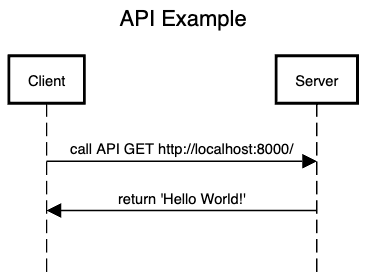

# Rest API method และ JSON
ในการทำ Rest API เราจะทำผ่าน HTTP server ซึ่ง HTTP นั้นมีมาตรฐานการส่งข้อมูลอยู่เราเรียกกันว่า "HTTP method" ซึ่งเป็นการระบุการแยก action แต่ละประเภทออกจากกันของฝั่ง client ออกจากกัน ซึ่งปกติ HTTP Method นั้นจะมีตัวที่ใช้กันบ่อยๆ คือ GET, POST, PUT, PATCH, DELETE เราจะมาลองทำความรู้จักแต่ละตัวกันว่าแต่ละ method เหมาะ

## 1. GET - retrive information
GET Method เป็น method ที่ใช้สำหรับการดึง information ออกมา และเอาจริงๆ การเปิด Browser ออกมา ก็ถือว่าเป็นการ request ด้วย method "GET" เป็น default อยู่แล้ว

ทีนี้ ปัญหาอย่างหนึ่งของการส่งข้อมูล response จาก API กลับมาเป็น text คือ ข้อมูลมันจะส่งได้เพียงข้อมูลชนิดเดียว ถ้าสมมุติเราพยายามดึงข้อมูลสักอย่างหนึ่งที่มีหลากหลาย field เช่น ดึงข้อมูล user คนนั้นออกมา โดยที่จะดึง

- firstname = ชื่อจริง
- lastname = นามสกุล
- age = อายุ

3 ข้อมูลนี้ออกมา pattern response แบบ Text จะไม่สะดวกกับเคสแบบนี้ ดังนั้น pattern ที่เราจะใช้สำหรับ response เราจะใช้เป็น pattern ที่ชื่อว่า "JSON" แทน Text

**example GET**
* res.send ออกเป็น text
* res.json ออกเป็น json
```js
// เรียกใช้ library express ด้วยคำสั่ง require
const express = require('express')

// ประกาศเริ่มต้นการใช้ express
const app = express()
const port = 8000

// สร้าง API path '/' และคืนคำ Hello world ออกมาผ่าน API
//respond มีไว้ส่งข้อมูลกลับไปยัง clientที่ร้องขอผ่านทาง APIที่ชื่อ path '/'
// '/test' คือ path หลักของ server เช่น http://localhost:8000/test
// req = request คือข้อมูลที่ client ส่งมา
// res = response คือข้อมูลที่ server ส่งกลับไปยัง client
//send() คือ method ที่ใช้ส่งข้อมูลกลับไปยัง client เป็นข้อความธรรมดา
app.get('/', (req, res) => {
  res.send('Hello World!')
})

// สร้าง API path '/test' และคืนคำเป็น JSON object ออกมาผ่าน API
//json() คือ method ที่ใช้ส่งข้อมูลกลับไปยัง client เป็น JSON object
app.get('/test', (req, res) => {
  let user = {
    firstname: 'ชื่อจริง',
    lastname: 'นามสกุล',
    age: 20
  };
  res.json(user)
})

// ประกาศ​gxbf http server ที่ port 8000 (ตามตัวแปร port)
app.listen(port, () => {
  console.log(`Example app listening on port ${port}`)
})

```

## JSON คืออะไร ?
JSON ย่อมาจาก JavaScript Object Notation เป็น format การส่งที่เลียนแบบ Javascript Object ที่ส่งเป็น Text ที่มีลักษณะเป็น Object แทนที่จะส่งเป็น Text ทั่วไปออกมาแทน ซึ่งเป็นรูปแบบที่ส่งผลทำให้สามารถส่งข้อมูลที่ซับซ้อนให้มีขนาดไม่ใหญ่มาก และทั้งมนุษย์และคอมพิวเตอร์สามารถอ่านออกได้ไม่ยาก จึงเป็น pattern ที่ค่อนข้างเป็นที่นิยมในการใช้ส่งใน API มาก (ทั้งการส่ง request และ การส่ง response)

ตัวอย่าง JSON สมมุติเรามี Javascript Object ที่เก็บข้อมูล firstname (ชื่อจริง), lastname (นามสกุล), age (อายุ)

Javascript Object หน้าตาจะเป็นแบบนี้
```javascript
{
  firstname: 'ทดสอบ',
  lastname: 'นามสกุล',
  age: 24
}
```
เมื่อเป็น JSON จะมีหน้าตาเป็นประมาณนี้แทน
```json
{"firstname":"ชื่อจริง","lastname":"นามสกุล","age":20}
```
_**ข้อสังเกต**_
- ทุก key ของ JSON จะใส่ double quote (แตกต่างกับ object ที่ใส่หรือไม่ใส่ก็ได้)
- ข้อมูลจะทำการย่อให้กลายเป็น text ขนาดก้อนเดียว (แต่ Postman และหลายๆเครื่องมือ มีเครื่องมืออำนวยที่ทำให้เราเห็น JSON ออกมาเป็นเหมือน object ใน javacsript ได้)

เราจะลองปรับ code กันใหม่เป็นแบบนี้แทน
- สร้าง path GET /user โดยจะ return JSON object ที่มี firstname, lastname, age ออกมา
```js
const express = require('express')
const app = express()

// สร้าง GET API path /user
app.get('/user', (req, res) => {
  res.json({
    firstname: 'ชื่อจริง',
    lastname: 'นามสกุล',
    age: 20
  });
})

const port = 8000
app.listen(port, () => {
  console.log(`Server is running on port ${port}`)
})
```
ผลลัพธ์ออกมาหน้าตาแบบนี้
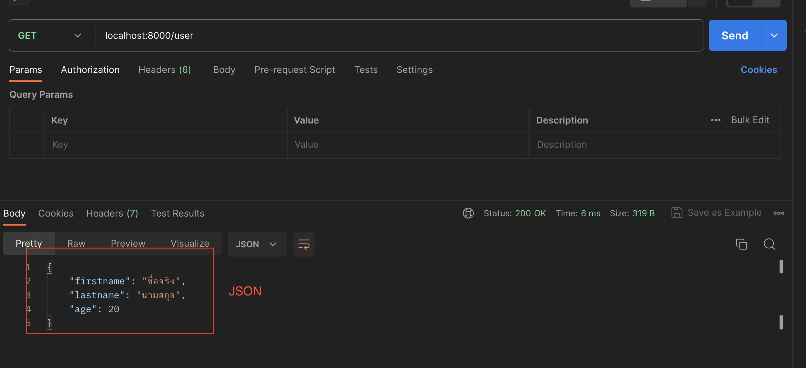

ซึ่งภาพนี้ JSON ได้ถูกแปลง format ให้สวยงามจาก postman แล้ว หากเราอยากดู format จริงๆที่ server response ออกมาให้กดไปที่ Raw ของ Postman ได้ จะเห็นหน้าตาออกมาเหมือนด้านบน
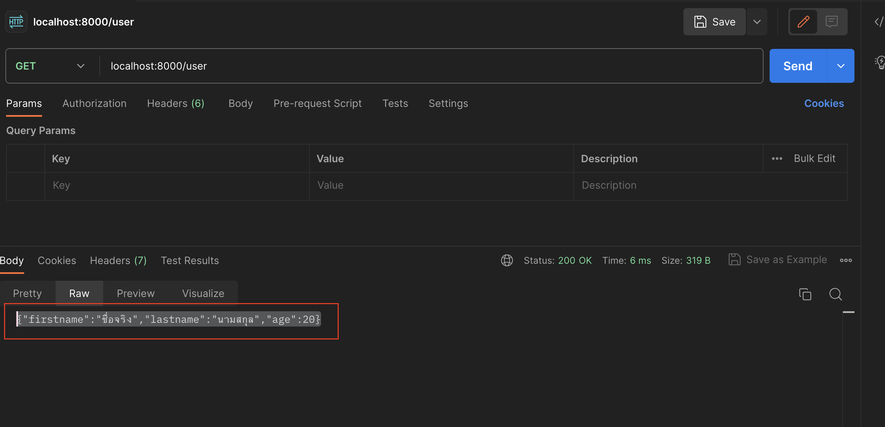

_**ข้อสังเกต**_
- เปลี่ยนจาก res.send() เป็น res.json() แทน เพื่อให้ express ทำการแปลง object ของ javascript ส่งออกมาเป็น JSON ได้

JSON format นั้นเราจะใช้กับการส่งข้อมูลทั้งหมด ไม่ว่าจะเป็นการส่งข้อมูลเข้า server จาก client (request) และ การตอบข้อมูลกลับจาก server (response)

## 2. POST - create new resource
POST Method เป็น method ที่ใช้สำหรับการเพิ่มข้อมูลเข้าสู่ระบบ ซึ่งจะเป็น Method ที่ทำให้เราส่งข้อมูลผ่าน body เข้ามาได้ (GET จะไม่สามารถทำได้)

ทีนี้ในการส่งข้อมูลเราจะเพิ่ม library อีกตัวขึ้นมา เพื่อให้การส่งข้อมูลผ่าน body จะเป็นการส่งเข้าตัวแปร req ผ่านมายัง key req.body ออกมาได้ (หากไม่ใช้ library นี้ข้อมูล body จะไม่สามารถดึงออกจากตัวแปรนี้ออกมาได้)

ทำการลง library body-parser
```
npm install body-parser
```
เมื่อลงทุกอย่างถูกต้อง
```json
{
  ... (ย่อ),
  "dependencies": {
    "body-parser": "^1.20.2", <-- จะมีตรงนี้เพิ่มมา
    "express": "^4.18.2" 
  }
}
```
เราจะมาลองตัวอย่างง่ายๆกันก่อนโดยการลองส่ง text ผ่าน body
```js
const express = require('express')
const app = express()
const bodyParser = require('body-parser')

app.use(bodyParser.text())

app.post('/test', (req, res) => {
  // ดึง data ออกจาก body
  const textData = req.body
  res.send(textData)
})

app.listen(8000, () => {
  console.log('Server started on port 8000')
})
```
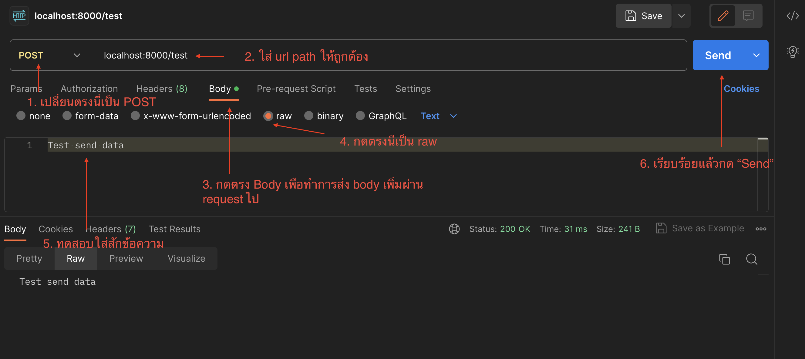

ทีนี้เราจะลองเปลี่ยนเป็น JSON และเพิ่ม use case เก็บ users
```js
const express = require('express')
const app = express()
const bodyParser = require('body-parser')

// Parse incoming JSON data
app.use(bodyParser.json())

// เราสร้างตัวแปร users ขึ้นมาเป็น Array จำลองการเก็บข้อมูลใน Server (ซึ่งของจริงจะเป็น database)
let users = []

// Route handler for creating a new user
app.post('/user', (req, res) => {
  const data = req.body

  const newUser = {
    firstname: data.firstname,
    lastname: data.lastname,
    age: data.age
  }

  //
  users.push(newUser)

  // Server ตอบกลับมาว่าเพิ่มแล้วเรียบร้อย
  res.status(201).json({ message: 'User created successfully', user: newUser })
})

app.listen(8000, () => {
  console.log('Server started on port 8000');
})
```
**example POST 2**
### JSON
* ยิง json ใน postman ต้องใส่  ```" "``` ด้วย

* ส่ง json
```js
// เพิ่มส่วนนี้เพื่อรองรับการรับข้อมูลแบบ POST เพื่อให้ดึงข้อมูลจาก body ได้
//import library
const express = require('express')
const app = express()
const port = 8000

const bodyparser = require('body-parser')
//app.use(bodyParser.text()) use() คือ method ที่ใช้เพิ่ม middleware ให้กับ express
app.use(bodyParser.json())//รองรับการรับข้อมูลแบบ json
//app.use(bodyParser.urlencoded({ extended: true }))รองรับการรับข้อมูลแบบ form-urlencoded
//middleware คือ function ที่ทำงานระหว่าง request กับ response

// เราสร้างตัวแปร users ขึ้นมาเป็น Array จำลองการเก็บข้อมูลใน Server (ซึ่งของจริงจะเป็น database)
// สำหรับเก็บ user
let users = []

//path = GET /users
app.get('/users', (req, res) => {
  res.json(users)
})

// path  = POST /user
app.post('/user', (req, res) =>{
  //รับ user ที่ส่งเข้ามาผ่าน body
  let user = req.body
  console.log('user', user)

  //เอาข้อมูลไปเก็บใน array
  users.push(user)
  res.json({
    message: 'add ok',
    user: user
  })

  //output terminal
  res.send(req.body)
})


//output terminal
app.listen(port, (req, res) => {
  console.log('http server run at ' + port)
})
```
**result POST**
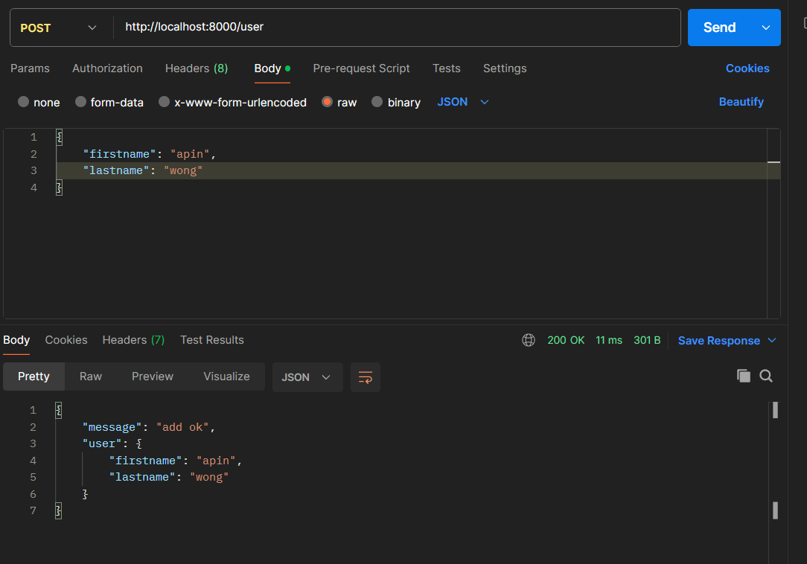

**result GET**
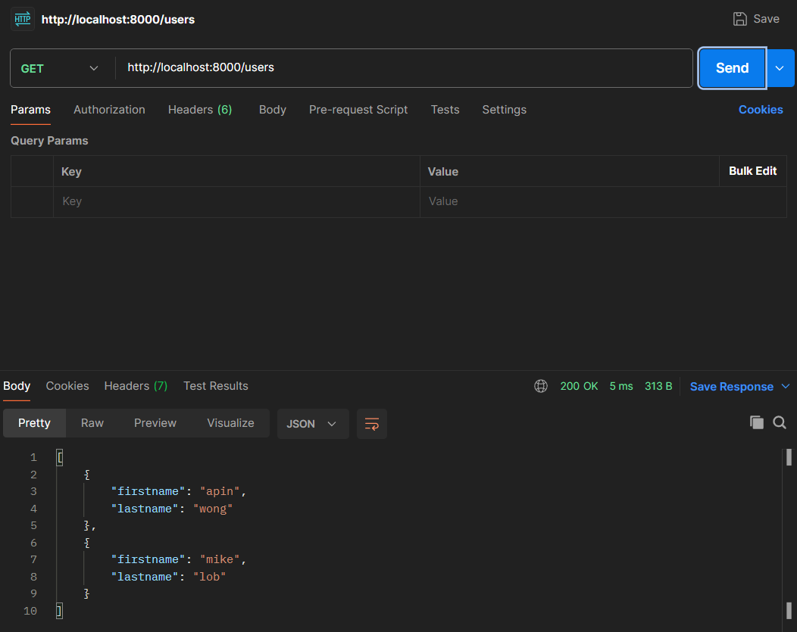

แล้วถ้าเพิ่มส่วนนี้เข้าไปจะทำให้นับไอดีแบบออโต้ตอน POST ด้วย
```js
// path  = POST /user
app.post('/user', (req, res) =>{
  //รับ user ที่ส่งเข้ามาผ่าน body
  let user = req.body
  user.id = counter //เพิ่มให้ user มี id เป็น atb <-----

  counter += 1 //นับ id 
  console.log('user', user)

  //เอาข้อมูลไปเก็บใน array
  users.push(user)
  res.json({
    message: 'add ok',
    user: user //show json ที่ส่งเข้ามา
  })
```
**result POST with counting ID**
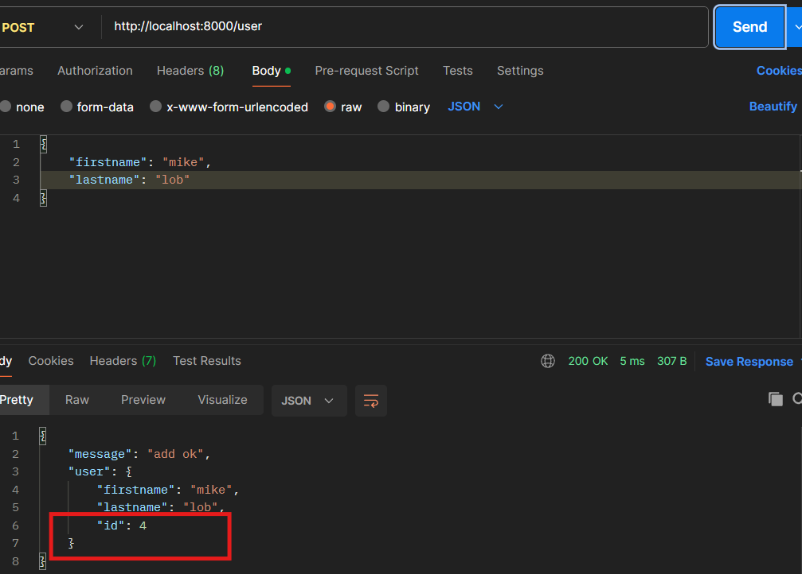

## 3. PUT - update existing resource
PUT Method เป็น method ที่ใช้สำหรับการแก้ข้อมูลเดิมในระบบ โดยจะ **เป็นการเข้าถึงทุก field**
- PUT ส่งผ่าน (/: )param เป็นการดึงค่าจาก url

ในนี้จะมีการใช้ parameter ที่ส่งมาผ่าน url เพื่อบอกว่าเป็น user คนไหน
```js
const express = require('express')
const app = express()
const bodyParser = require('body-parser')

app.use(bodyParser.json())
let users = []

// ใช้สำหรับสร้างก่อน
app.post('/user', (req, res) => { ... (code เดิมกับอันบน) })

// ใช้สำหรับแก้ไข
app.put('/user/:id', (req, res) => {
  const id = req.params.id
  const data = req.body

  const userToUpdate = users.find((user) => user.id === parseInt(id))

  if (!userToUpdate) {
    return res.status(404).json({ message: 'User not found' })
  }

  userToUpdate.firstname = data.firstname || userToUpdate.firstname
  userToUpdate.lastname = data.lastname || userToUpdate.lastname
  userToUpdate.age = data.age || userToUpdate.age

  res.json({ message: 'User updated successfully', user: userToUpdate })
})
```
**example PUT 2**
```js
//import library
const express = require('express')
const app = express()

const bodyparser = require('body-parser')
app.use(bodyparser.json())

const port = 8000


// สำหรับเก็บ user
let users = []
let counter = 1

//path = GET /users
app.get('/users', (req, res) => {
  res.json(users)
})

// path  = POST /user
app.post('/user', (req, res) =>{
  //รับ user ที่ส่งเข้ามาผ่าน body
  let user = req.body
  user.id = counter //เพิ่มให้ user มี id เป็น atb

  counter += 1 //นับ id 
  console.log('user', user)

  //เอาข้อมูลไปเก็บใน array
  users.push(user)
  res.json({
    message: 'add ok',
    user: user //show json ที่ส่งเข้ามา
  })

  //output terminal
  res.send(req.body)
})

// path = PUT /user/:id (:id = parameter)
app.put('/user/:id', (req, res) => {
  let id = req.params.id //params ใช้ได้กับทุก method
  let updateUser = req.body

  //หา user จาก id ที่ส่งมา
  let selectedIndex = users.findIndex(user => user.id == id)
 
  //เหลือบรรทัดเดียวได้แบบข้างบน
  /*let selectedIndex = users.findIndex(user => {
    if (user.id == id) {
      return true
    } else {
      return false
    }
  })*/

    //update ข้อมูล user (null || 'ค่าที่ update')
  users[selectedIndex].firstname = updateUser.firstname || users[selectedIndex].firstname 
  users[selectedIndex].lastname = updateUser.lastname || users[selectedIndex].lastname

  //ส่งข้อมูลที่ update เสร็จแล้วกลับไป
  res.json({
    message: 'update user complete!',
    data: {
      user: updateUser,
      indexUpdate: selectedIndex
    }
  })
})

//output terminal
app.listen(port, (req, res) => {
  console.log('http server run at ' + port)
})
```
ค่าที่เราอัปเดตไปพอไปเรียก GET มันจะแสดงค่าที่เราอัปเดตไปตรง id ที่เราใส่ไป
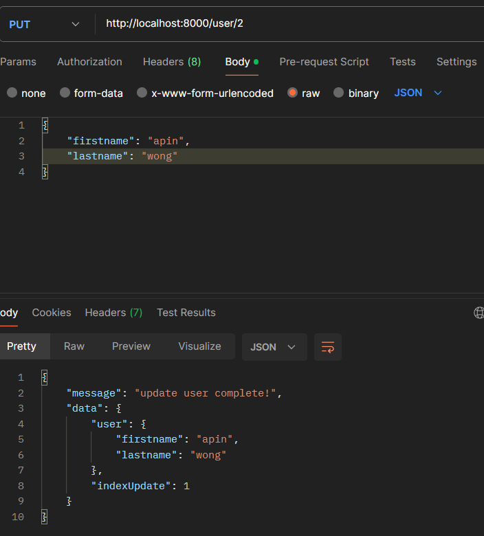

## 4. PATCH - update only fields in resource
PATCH Method เป็น method ที่ใช้สำหรับการแก้ข้อมูลเดิมในระบบ โดยจ **เป็นการเข้าถึงเฉพาะ field ที่ส่งเข้ามาเท่านั้น**(แตกต่างกับ PUT ที่ access ทุก field)
```js
const express = require('express')
const app = express()
const bodyParser = require('body-parser')

app.use(bodyParser.json())
let users = []

app.post('/user', (req, res) => { ... (code เดิมกับอันบน) })

// ลองเปลี่ยนจาก put เป็น patch
app.patch('/user/:id', (req, res) => {
  const id = req.params.id
  const data = req.body

  const userToUpdate = users.find((user) => user.id === parseInt(id))

  if (!userToUpdate) {
    return res.status(404).json({ message: 'User not found' })
  }

  if (data.firstname) {
    userToUpdate.firstname = data.firstname
  }

  if (data.lastname) {
    userToUpdate.lastname = data.lastname
  }

  if (data.age) {
    userToUpdate.age = data.age
  }

  res.json({ message: 'User updated successfully', user: userToUpdate })
})
```
**example PATCH 2**
ไม่มีอะไรมากแค่ตรวจแล้วแก้ทีละฟิลด์แต่อัปเดตออกมาเเล้วก้เหมือนกัน
```js
// path = PATCH /user/:id (:id = parameter)
app.patch('/user/:id', (req, res) => {
  let id = req.params.id //params ใช้ได้กับทุก method
  let updateUser = req.body//อ่านค่าที่จะ update

  //หา user จาก id ที่ส่งมา
  let selectedIndex = users.findIndex(user => user.id == id)
 
   
  //update ข้อมูล user 
  //if มีข้อมูลupdate อันไหน ค่อยupdate อันนั้น 
  if (updateUser.firstname) {
    users[selectedIndex].firstname = updateUser.firstname
  }
  
  if (updateUser.lastname) {
    users[selectedIndex].lastname = updateUser.lastname 
  }
})
```

## 5. DELETE - delete resource
DELETE Method เป็น method ที่ใช้สำหรับส่งข้อมูลที่ต้องการลบข้อมูล
```js
const express = require('express')
const app = express()
const bodyParser = require('body-parser')

app.use(bodyParser.json())
let users = []

app.post('/user', (req, res) => { ... (code เดิมกับอันบน) })

app.delete('/user/:index', (req, res) => {
  const index = req.params.index

  // Check if the index is valid
  if (index >= 0 && index < users.length) {
    // Remove the user at the specified index
    const deletedUser = users.splice(index, 1)[0]
    res.json({ message: 'User deleted successfully', user: deletedUser })
  } else {
    res.status(404).json({ error: 'User not found' })
  }
})
```
**example DELETE 2**
```js
// path = DELETE /user/:id
app.delete('/user/:id', (req, res) => {
  let id = req.params.id

  //หา user จาก id ที่ส่งมา
  let selectedIndex = users.findIndex(user => user.id == id)

  //ลบ
  //delete users[selectedIndex] ลบแบบนี้จะหายไปเลยกลายเป็น NUll ไม่สวย ทำแบบล่างแทน

  //(indexที่จะลบ, จำนวนที่จะลบ)
  // จะเรียง index ใหม่ให้เลย
  users.splice(selectedIndex, 1)

  res.json({
    message: 'delete complete!',
    indexDelete: selectedIndex
  })
})
```
มันจะแสดงออกมาแบบนี้ให้เห็นแสดงว่าลบไปแล้ว
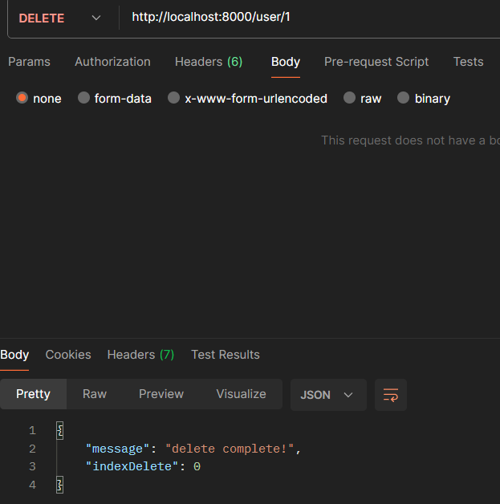
