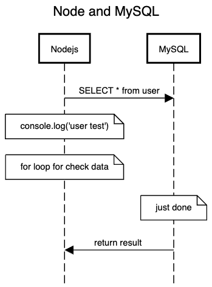
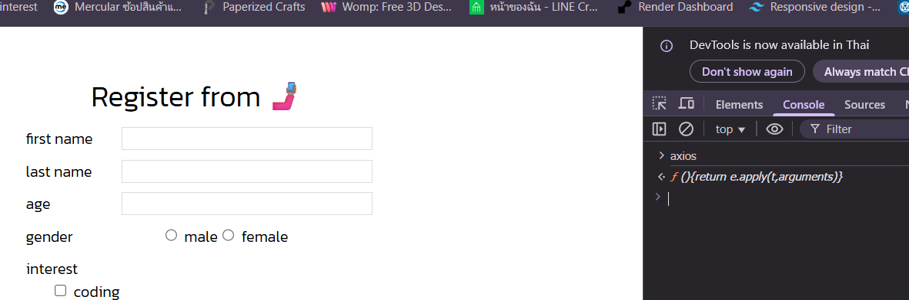
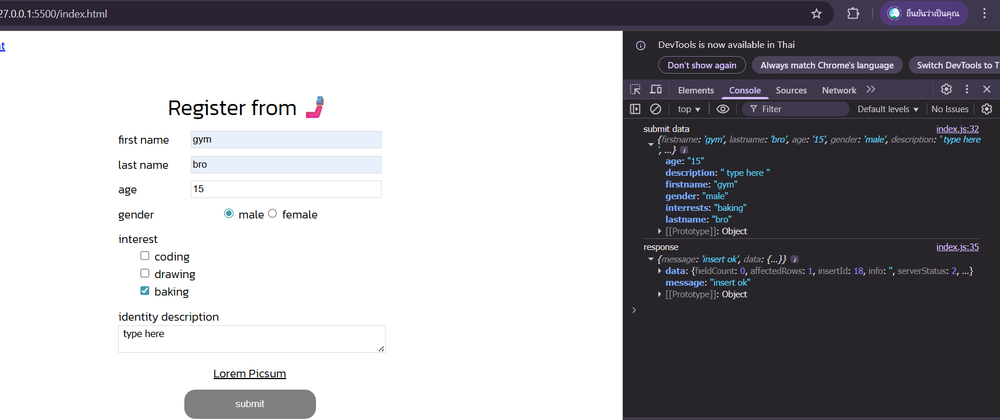

# ต่อจาก note.md
### config phpMyAdmin ที่อัปเดตหรือโหลดแยกจาก MAMP อ่านส่วนนี้เฉพาะคนที่ ทำการอัปเดตหรือโหลดแยกมานะ
ในกรณีของเราที่ทำการอัปเดต phpMyAdmin ทำให้ ตัวที่อัปเดตมาไปเชื่อมกับฐานข้อมูล localhost ของเครื่อง ทีนี้เราจะไป config แก้ให้มันไป เชื่อมฐานข้อมูลของ MAMP กัน
ไปจุดที่เก็บโฟลเดอร์ MAMP ที่ให้ดูอันนี้คือกรณีของเรา MAMP default คือ port 8889
```php
// C:\MAMP\bin\phpMyAdmin
// จากนั้น หาไฟล์ชื่อ config.inc.php เปิดด้วย VSC และแก้โค้ดเป็น
// บน Windows + Node.js/PHP + MEMP → แนะนำใช้ 127.0.0.1 เพราะ MEMP ใช้ พอร์ต 8889 บังคับ TCP/IP port
//localhost → ใช้ได้กับ default MySQL socket แต่ อาจ connect ผิดพอร์ต ,พยายามใช้ socket

<?php
declare(strict_types=1);

/**
 * phpMyAdmin configuration for MEMP MySQL
 */

// สำหรับ cookie-based login
$cfg['blowfish_secret'] = 'a8B3cD9eF1gH2iJ3kL4mN5oP6qR7sT8'; // เปลี่ยนเป็น string สุ่มของคุณเอง

$i = 0;
$i++;

// ประเภทการ authentication
//MySQL 
$cfg['Servers'][$i]['auth_type'] = 'cookie';

// Server MySQL ของ MEMP
$cfg['Servers'][$i]['host'] = '127.0.0.1';  
$cfg['Servers'][$i]['port'] = 8889;         // พอร์ตของ MEMP
$cfg['Servers'][$i]['compress'] = false;
$cfg['Servers'][$i]['AllowNoPassword'] = ture; // true ถ้า root ไม่มีรหัสผ่าน

// โฟลเดอร์สำหรับอัปโหลด/บันทึกไฟล์
$cfg['UploadDir'] = '';
$cfg['SaveDir'] = '';
```

# รู้จักกับ Promise และ async, await
Promise คือ concept ของ Javascript ที่ใช้สำหรับจัดการเหตุการณ์ที่เป็น asynchronous
- asynchronous คือเหตุการณ์ที่เกิดขึ้นมา และจะไปรัน background ต่อเองจนเสร็จ เช่น การขอข้อมูล user จาก database (เนื่องจาก nodejs และ mysql เป็นคนละ service กัน ทำให้มันเกิดเหตุการณ์เกิดขึ้นคนละที่ได้ )

- Promise คือสิ่งที่ทำให้เราสามารถ handle เหตุการณ์แบบนี้ได้ คือ หลังจากที่ข้อมูลส่งกลับมา (จาก asynchrous) จะให้ javascript (ในทีนี้คือ nodejs) จัดการอย่างไรต่อบ้าง
- ท่าปกติของการ handle Promise คือ .then (ต่อหลังจาก function Promise) และ .catch (ต่อหลังจาก .then เพื่อทำการ handle error) 

**ตัวอย่าง promise ต่อแบบ promise ใช้กับอะไรที่ต้องรอ**
ลองนำ Rest API สักอันต่อ โดยที่เราจะมาลองเปลี่ยน /users ให้ดึงผ่านฐานข้อมูลแทน
```js
//import library
const express = require('express')
const bodyparser = require('body-parser')
const mysql = require('mysql2/promise')

const app = express()
const port = 8000 //port server

/*-------------- promise ---------------*/
app.get('/testdb', (req, res) => {
  mysql.createConnection({
    host: 'localhost', // TCP connection 127.0.0.1
    user: 'root',
    password: 'root',
    database: 'tutorials', //ใส่ชื่อ data base
    port: 8889 //ถ้าใช้localhost ต้องใส่ port ด้วย แต่ถ้าใช้ 127.0.0.1 ไม่ต้องใส่
  }).then((conn) => {
    // สิ่งนี้เราเรียกกันว่า promise
    conn //connection object ที่ได้จากการเชื่อมต่อ MySQL
    .query('SELECT * FROM users') //ใส่ชื่อ from
    .then((results) => {
      res.json(results[0]) //เป็นการแสดงข้อมูลใน MySQL ของ library mysql2
    })
    .catch((error) => {
      console.error('Error fetching users:', error.message)
      res.status(500).json({ error: 'Error fetching users' }) //500 คือ status code
    })
  })
})
/*-----------------------------------------*/

//output terminal
app.listen(port, (req, res) => {
  console.log('http server run at ' + port)
})
```
**result GET DB Users**


ทีนี้ปัจจุบันมีท่า async, await ที่สามารถจัดการ promise ได้แบบเดียวกันกับการใช้ .then และสามารถใช้ try, catch เพื่อทำการ handle error ลองดูตัวอย่าง code ด้านล่างเพ่ือเทียบกับ code .then, .catch

**ต่อแบบ async await เหมือน promise แค่โค้ดจะสวยกว่า**
```js
//import library
const express = require('express')
const bodyparser = require('body-parser')
const mysql = require('mysql2/promise')

const app = express()
const port = 8000 //port server

/*-------------- async ---------------*/
// สิ่งนี้เราเรียกกันว่า async await
app.get('/testdb-new', async(req, res) => { 
  try {
  const conn = await mysql.createConnection({ 
    host: 'localhost',
    user: 'root',
    password: 'root',
    database: 'tutorials',
    port: 8889
  })
    const results = await conn.query('SELECT * FROM users') 
    res.json(results[0])
  } catch (error) {
    console.error('Error fetching users:', error.message)
    res.status(500).json({ error: 'Error fetching users' }) 
  }
})

/*-----------------------------------------*/

//output terminal
app.listen(port, (req, res) => {
  console.log('http server run at ' + port)
})
```

จะสังเกตว่า
- code จะอ่านง่ายกว่าเนื่องจากเป็น code ทีสามารถอ่านจากบนลงล่างได้เหมือนเดิม (แตกต่างกับท่า Promise ที่มันจะค่อยๆ handle ตาม function ที่อยู่ใน .then ไป)
- ดังนั้น หลังจากนี้ตลอดบทความเราจะใช้ท่า async, await แทน (แต่ที่แนะนำท่านี้ เพราะหลายบทความยังคงใช้ท่า Promise .then, .catch อยู่ เพื่อไม่ให้คนที่กำลังศึกษาอยู่สับสน จริงๆแล้วจะสามารถให้ผลลัพธ์ที่เหมือนกันได้)

## Connect API <-> DB(MySQL) แบบที่ 2 ทำเป็นฟังก์ชั่น
* เปลี่ยน connnection เป็น function เพื่อที่ทุก method จะได้เรียกใช้ conn ได้
```js
//import library
const express = require('express') //จัดการ API
const bodyparser = require('body-parser')
const mysql = require('mysql2/promise') 

const app = express()
app.use(bodyparser.json())

const port = 8000 //port server

/*------------- connect MySQL --------------*/
let conn = null //ตัวแปรเอาไว้คุยกับ MySQL
const initMySQL = async () => {
  conn = await mysql.createConnection({
    host: 'localhost',
    user: 'root',
    password: 'root',
    database: 'tutorials', //ใส่ชื่อ data base
    port: 8889
  })
}
/*------------------------------------------*/

/*-------------- async await ---------------*/
//path = '/testdb' ดึงข้อมูลทั้งหมดใน table มาโชว์
app.get('/testdb', async (req, res) => {
  try {
  const results = await conn.query('SELECT * FROM users') //เรียกใช้ conn
  res.json(results[0])
  } catch (error) {
    console.error('Error fetching users:', error.message)
    res.status(500).json({ error: 'Error fetching users' }) 
  }
})
/*-----------------------------------------*/

//output terminal
app.listen(port, async (req, res) => {
  await initMySQL() //รอ connect MySQL (initMySQL()) ให้เสร็จ
  console.log('http server run at ' + port)
})
```

## นำ Rest API ต่อกับ MySQL
1. ```npm install cors ``` library cors = cross-origin resource sharing คือการเปิดให้ client ที่อยู่คนละที่กันเข้ามาใช้ API ได้ 
```js
//import library
const express = require('express') 
const bodyparser = require('body-parser')
const mysql = require('mysql2/promise')
const cors = require('cors') <===========


const app = express()
app.use(bodyparser.json())
app.use(cors()) <=========== //เปิดให้ client ที่อยู่คนละที่กันเข้ามาใช้ API ได้

const port = 8000

/*
✅GET /users สำหรับ get users ทั้งหมดที่บันทึกเข้าไปออกมา
✅POST /users สำหรับการสร้าง users ใหม่บันทึกเข้าไป
✅GET /users/:id สำหรับการดึง users รายคนออกมา
✅PUT /users/:id สำหรับการแก้ไข users รายคน (ตาม id ที่บันทึกเข้าไป)
✅DELETE /users/:id สำหรับการลบ users รายคน (ตาม id ที่บันทึกเข้าไป)
*/

let conn = null

const initMySQL = async () => {
  conn = await mysql.createConnection({
    host: 'localhost',
    user: 'root',
    password: 'root',
    database: 'tutorials', //ใส่ชื่อ data base
    port: 8889
  })
}


//path = GET /users สำหรับ get users ทั้งหมดที่บันทึกเข้าไปออกมา
app.get('/users', async (req, res) => {
  const results = await conn.query('SELECT * FROM user') //ชื่อต้องตรงกับ DB
    res.json(results[0])
})


// path  = POST /users สำหรับการสร้าง users ใหม่บันทึกเข้าไป
app.post('/users', async (req, res) => {
  try {
    const userData = req.body                         
    const results  = await conn.query('INSERT INTO user SET ?', userData) //ใส่ ? เพื่อจะได้ใส่ userData

    res.json({ 
      message: 'insert ok', 
      data: results[0] 
    })

  } catch (error) {
    console.error('Error message', error.message)
    res.status(500).json({
      message: 'somthing wrong'
    })
  }
})


//path = GET /users/:id สำหรับการดึง users รายคนออกมา
app.get('/users/:id', async (req, res) => {
  try {
    let id = req.params.id
    const results = await conn.query('SELECT * FROM user WHERE id = ?' , id) //ชื่อต้องตรงกับ DB
    console.log('result: ', results)

    //if check ว่ามีไหม เพราะถ้าไม่มีมันจะเป็นค่าว่าง หรือ == 0
    if (results[0].length == 0 ){
      throw {statusCode: 404, message: 'not found'}
    }
    res.json(results[0][0]) //จะได้ออกมาเป็น obj
    //res.json(results[0]) //จะได้ออกมาเป็น array

  } catch (error) {
    console.error('Error message', error.message)
    let statusCode = error.statusCode || 500
    res.status(statusCode).json({
      message: 'somthing wrong' ,
      errorMassage: error.message
    })
  }
})


//path = PUT /users/:id สำหรับการแก้ไข users รายคน (ตาม id ที่บันทึกเข้าไป)
app.put('/users/:id', async (req, res) => {
  try {
    let id = req.params.id
    let updateUser = req.body
    const results  = await conn.query(
      'UPDATE user SET ? WHERE id = ?', 
      [updateUser , id]
    )

    res.json({ 
      message: 'update ok', 
      data: results[0] 
    })

  } catch (error) {
    console.error('Error message', error.message)
    res.status(500).json({
      message: 'somthing wrong'
    })
  }
})


// path = DELETE /users/:id สำหรับการลบ users รายคน (ตาม id ที่บันทึกเข้าไป)
app.delete('/users/:id', async (req, res) => {
 try {
    let id = req.params.id
    const results  = await conn.query('DELETE FROM user WHERE id = ?', id)

    res.json({ 
      message: 'delete ok', 
      data: results[0] 
    })

  } catch (error) {
    console.error('Error message', error.message)
    res.status(500).json({
      message: 'somthing wrong'
    })
  }
})


//output terminal
app.listen(port, async (req, res) => {
  await initMySQL()
  console.log('http server run at ' + port)
})
```
## เราจะลองใช้คำสั่ง fetch สำหรับเรียก API จากฝั่งหน้าบ้านกัน
```html
<!DOCTYPE html>
<html lang="en">
<head>
    <meta charset="UTF-8">
    <meta name="viewport" content="width=device-width, initial-scale=1.0">
    <title>Document</title>
</head>
<body>
    <script>
        fetch('http://localhost:8000/users')
        .then(res => res.json())
        .then(responseData => {
            console.log(responseData)
        })
    </script>
</body>
</html>
```
เมื่อรันหน้านี้จะแสดงผลลัพท์ที่ console ของเว็บ


องค์ประกอบของ fetch จะประกอบด้วย
- fetch(url) คือการระบุ path API ที่ต้องการส่ง / ขอข้อมูลไป (ซึ่งถ้าไม่ใส่อะไรเลย default จะเป็นการส่งค่าแบบ GET) ถ้าจะส่ง method แบบอื่นสามารถดูตามเอกสารได้
- .then() ก็คือท่า promise ที่จะสร้างเป็น function สำหรับจัดการหลัง fetch ได้ค่าออกมาแล้ว (เหมือน promise ใน nodejs เลย)
ซึ่งท่า fetch นี้เป็นท่าที่เป็น standar

ซึ่งท่า fetch นี้เป็นท่าที่เป็น standard ของ browser เองที่สามารถ call ไปยัง API ได้ ซึ่งข้อดีของ fetch คือ ไม่ต้องลง library อะไรเพิ่มก็สามารถใช้งานได้เลย

ปัญหาของ fetch มันมีอยู่ว่า
- fetch จะต้องเพิ่มการ parse data ออกมาว่าได้ข้อมูลออกมาเป็นประเภทอะไร จากตรง response.json() นั่นแหละ ทำให้เราต้องสร้าง Promise มา 2 ชั้นเพื่อแปลงข้อมูลก่อนที่จะเอาไปใช้ได้จริงๆ
- รวมถึงถ้า API เกิด Error (เช่น return status ออกมาเป็น 404) ขึ้นมา ด้วยคำสั่ง fetch จะต้องทำการ handle error จาก Promise เอง

ดังนั้นเพื่อลดขั้นตอนของการ call จะขอเปลี่ยนมาใช้ axios แทน
- สิ่งที่ต้องเพิ่มคือ ต้องเพิ่ม script สำหรับการนำ library axios เข้ามา โดยการเพิ่มใน tag html ได้เลย
```html
<html>
  <head> ... </head>
  <body>
    ...
    <script src="https://cdn.jsdelivr.net/npm/axios/dist/axios.min.js"></script> <!-- เพิ่ม script axios เข้ามา-->
    <script src="index.js"></script>
  </body>
</html>
```
ลองใช้คำสั่ง axios ที่ console ถ้าถูกจะได้


## ลองส่งข้อมูลใน from (index.html)
```html
<!DOCTYPE html>
<html lang="en">
    <head>
        <title>Register from </title>
        <meta charset="UTF-8">
        <meta name="viewport" content="width=device-width, initial-scale=1">
        <link rel="stylesheet" href="style.css">
    </head>

    <body>
    <a href="user.html">go to user management</a>
    
    <div class="container">
        <div class="header from-input emoji"> <!-- มี 2 class แบบนี้ได้ เว้นด้วยเคาะ -->
            Register from 
        </div>

        <div class="flex from-input">
            <div class="header-from" >  
                first name 
            </div> 
            <input class="from" type="text" name="firstname">
        </div>
        <div class="flex from-input">
            <div class="header-from"> 
                last name 
            </div>
            <input class="from" type="text" name="lastname">
        </div>
        <div class="flex from-input">
            <div class="header-from">
                age
            </div> 
            <input class="from" type="number" min ="0" max="100" name="age">
        </div>

    
        <div class="gender flex from-input">
            <div class="header-from"> gender </div>
            <div class="flex">
                <div>
                    <input name="gender" type="radio" value="male"> male
                </div>
                <div>
                    <input name="gender" type="radio" value="female"> female
                </div>
            </div>
        </div>
    
        <div class="interest from-input">
            interest
            <div>
                <input class="interest" name="interest" type="checkbox" value="coding"> coding
            </div>
            <div>
                <input class="interest" name="interest" type="checkbox" value="drawing"> drawing
            </div>
            <div>
                <input class="interest" name="interest" type="checkbox" value="baking"> baking
            </div>
        </div>
    
        <div class="description from-input">
            identity description
            <div>
                <textarea name="description" id=""> type here </textarea>
            </div>
        </div>
        
       <div class="link from-input center">
        <a  class="link" href="https://picsum.photos/">Lorem Picsum</a>
       </div>
        
       <!--message-->
       <div class="message" id="message">
    
       </div>

        <!--ปุ่มส่ง-->
        <div class="center">
            <button class="button" onclick="submitData()">submit</button>
        </div>
        
    </div>
    <!-- JS -->
     <script src="https://cdn.jsdelivr.net/npm/axios@1.6.7/dist/axios.min.js"></script> <!--เพิ่มการเชื่อม axios-->
     <script src="index.js"></script>
    </body>
</html>
```
Javascript ในการส่งข้อมูล
```js
const BASE_URL = 'http://localhost:8000'

const submitData = async() => {
    //เข้าถึงทุกฟิลด์
    let firstnameDom = document.querySelector('input[name=firstname]')
    let lastnameDom = document.querySelector('input[name=lastname]')
    let ageDom = document.querySelector('input[name=age]')

    let genderDom = document.querySelector('input[name=gender]:checked')
    let interestDoms = document.querySelectorAll('input[name=interest]:checked')

    let descriptionDom = document.querySelector('textarea[name=description]')

    let interest = ''
    for (let index = 0; index < interestDoms.length; index++) {
        interest += interestDoms[index].value 
        if(index != interestDoms.length -1){ //จะใส่ , ถ้าไม่ใช่ตัวสุดท้าย
           interest +=  ' , '
        }
    }

    //สร้าง obj มาเก็บค่าเพื่อส่งให้ backend
    let userData = {
        firstname: firstnameDom.value ,
        lastname: lastnameDom.value ,
        age: ageDom.value ,
        gender: genderDom.value ,
        description: descriptionDom.value ,
        interrests: interest
    }

    console.log('submit data' , userData)
    const response = await axios.post(`${BASE_URL}/users`, userData) //ยิง userData ไปเก็บที่ MySQl เหมือนที่ลองยิงใน postman แล้วเก็บผลลัพธ์

    console.log('response', response.data)
    
}
```
**result**


# หลังจากนี้จะเป็นการอธิบายวิธีรับ API จากหน้าบ้านส่งไปบันทึกหลังบ้านพร้อมฟอร์มตรวจสอบข้อมูล มันสรุปออกมายากให้เข้าไปดูที่เอกสารได้เลย
[Doc P'Mike](https://docs.mikelopster.dev/c/web101/chapter-11/intro)

## note เพิ่มเติม
Question => ทำไม server ใช้ UserData ในการเก็บ obj แต่ทำไมต้องใช้คำว่า data เพื่อบอกถึงก้อนข้อมูล มันเป็นตัวแปรพื้นฐานหรือเราประกาศออกมาเอง ???

Ans => response.data ไม่ได้มาจากตัวแปรที่คุณประกาศเอง
แต่เป็น โครงสร้างมาตรฐานของ axios —
axios จะ “ห่อ (wrap)” ค่าที่ server ส่งกลับมา แล้วเก็บไว้ใน property ที่ชื่อว่า .data เสมอ

### 🔍 อธิบาย

เวลา client (ฝั่ง browser) เรียก API เช่น
```js
const response = await axios.post('http://localhost:8000/users', userData)
```
1. ฝั่ง client ส่งข้อมูล userData ไปให้ server
(axios จะส่งไปในรูป JSON เพราะมันตั้งค่า header เป็น
Content-Type: application/json ให้โดยอัตโนมัติ)

2. ฝั่ง server (Node.js/Express) รับไว้ใน req.body
เพราะเราประกาศ app.use(express.json())
ตัว req.body นี้จะเท่ากับ object ที่ client ส่งมา เช่น
```js
{
  firstname: "mink",
  lastname: "สัมพุดโดพะคะวา",
  ...
}
```

3. จากนั้น server จะประมวลผล แล้ว “ตอบกลับ” ด้วย res.json()
เช่นในโค้ดของคุณ:
```js
res.json({
  message: 'insert ok',
  data: results[0]
})
```
ส่วนที่อยู่ใน res.json({...}) — นี่แหละคือ ข้อมูลจริง (response body)
ที่ axios จะรับมาจาก server

4. axios ฝั่ง client เมื่อได้รับ response จาก server
มันจะสร้าง object ที่มีโครงสร้างแบบนี้ 👇
```js
{
  data: { message: 'insert ok', data: { id: 1 } }, // ✅ นี่คือสิ่งที่ server ส่งมา
  status: 200,
  statusText: 'OK',
  headers: { ... },
  config: { ... },
  request: { ... }
}
```
จะเห็นว่า axios เป็นคน “ตั้งชื่อ” ว่าส่วนที่เป็นข้อมูลจริงชื่อว่า data
ไม่ใช่คุณตั้งเอง และไม่เกี่ยวกับ userData ในฝั่ง server เลย